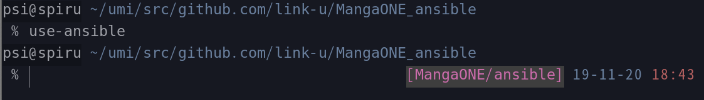

# ansibleクライアント

## 1. 目次

<!-- TOC depthFrom:2 -->

- [1. 目次](#1-目次)
- [2. 特徴](#2-特徴)
- [3. 使い方（例）](#3-使い方例)
    - [3.1. ラッパーを使う](#31-ラッパーを使う)
    - [3.2. activateを使う](#32-activateを使う)
- [4. パッケージを追加したい](#4-パッケージを追加したい)
    - [4.1. 説明](#41-説明)
    - [4.2. ディレクトリ構造](#42-ディレクトリ構造)
    - [4.3. 追加するreq.txtの中身の例](#43-追加するreqtxtの中身の例)
- [5. ansible collections を追加したい](#5-ansible-collections-を追加したい)
    - [5.1. 説明](#51-説明)
    - [5.2. ディレクトリ構造](#52-ディレクトリ構造)
    - [5.3. 追加する req_req_collections.yml の中身の例](#53-追加する-req_req_collectionsyml-の中身の例)
    - [5.4. ansible-collection の探し方](#54-ansible-collection-の探し方)
- [6. その他](#6-その他)
- [7. Licence](#7-licence)

<!-- /TOC -->

<br>

## 2. 特徴

 - ansible-playbookのラッパー
 - バージョンを固定してインストール。
 - このリポジトリがアップデートされるたびに、変更に追従してansibleも自動でアップデート。

<br>

## 3. 使い方（例）

好みに応じて、どうぞ。

### 3.1. ラッパーを使う

```bash
# MangaHoge_ansibleの直下で

git submodule init
git submodule add git@github.com:link-u/ansible-tools_client.git client

client/ansible-playbook -i hosts .....
client/ansible -m ping ....
```

<br>

### 3.2. activateを使う

```bash
# MangaHoge_ansibleの直下で

git submodule init
git submodule add git@github.com:link-u/ansible-tools_client.git client

. client/_scripts/activate

ansible-playbook -i hosts ...
ansible -m ping ...

# すべてが終わったら
deactivate
```

zsh向けに次みたいなヘルパも作りました、.zshrcにでも放り込んでみてね。

```zsh
function use-ansible() {
  local root=$(git rev-parse --show-toplevel)
  if [ ! -d ${root} ]; then
    echo "You are not on any git repository."
    return -1
  fi
  local repo=$(echo $(basename ${root}) | sed -e 's/_/\//')
  zsh --login -c "\
    source ${root}/client/_scripts/activate &&\
    RPROMPT='%B%K{239}%F{212}[${repo}]%f%k%b %B%(?.%.%)%D %%T%b' zsh"
}
```

これをセットすると、各プロジェクトごとのansibleがactivateされます（その旨の表示も出るよ）。



<br>

## 4. パッケージを追加したい

### 4.1. 説明

デフォルトだと `_scripts` 以下の `req.txt` にあるライブラリのみインストールするが、プロジェクトによっては他のライブラリもインストールしたいケースがある。  
その場合、プロジェクトのリポジトリルートに `req.txt` を置いてそれに追記する。

<br>

### 4.2. ディレクトリ構造

```
ansible-project/
├── hosts       # インベントリファイル
├── client/...  # ansible-tools_client (サブモジュールとして追加したこのリポジトリ)
├── req.txt     # これを作成
├── roles/
```

<br>

### 4.3. 追加するreq.txtの中身の例

以下はpasslibを追加している。

```
ansible>=2.10,<2.11
Jinja2>=2.11,<2.12
passlib==1.7.4
```

<br>

## 5. ansible collections を追加したい

### 5.1. 説明

デフォルトだと `_scripts` 以下の `req_collections.yml` にある collection のみをインストールする。<br>
追加で新たな collection をインストールしたい場合はこのリポジトリの親ディレクトリに `req_collections.yml` を設置する。

<br>

### 5.2. ディレクトリ構造

```
ansible-project/
├── hosts                       # インベントリファイル
├── client/...                  # ansible-tools_client (サブモジュールとして追加したこのリポジトリ)
├── req_req_collections.yml     # これを作成
├── roles/
```

<br>

### 5.3. 追加する req_req_collections.yml の中身の例

```yaml
---
collections:
  - name: community.proxysql
  - name: community.vmware
  - name: community.libvirt
```

<br>

### 5.4. ansible-collection の探し方

基本的に [ansible-galaxy](https://galaxy.ansible.com/) から見つける.

その中でも特に [ansible-community](https://galaxy.ansible.com/community) は Ansible by Red Hat の提供なので, 実質的に Ansible の公式 collection である.

上記の例もすべて ansible-community の collection である.

<br>

## 6. その他

[_scripts/req.txt](_scripts/req.txt)が更新されるたびに_venvs/が肥大化していくので、たまに消してあげてください。

## 7. Licence
MIT
